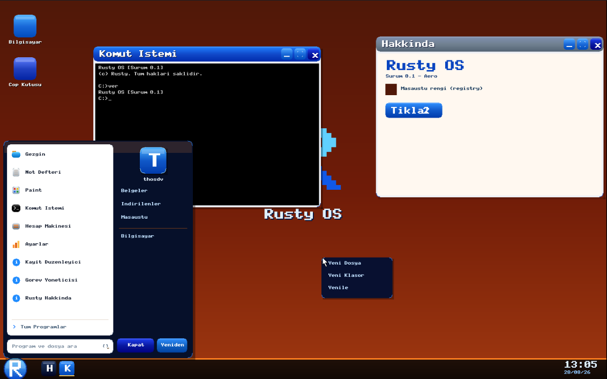
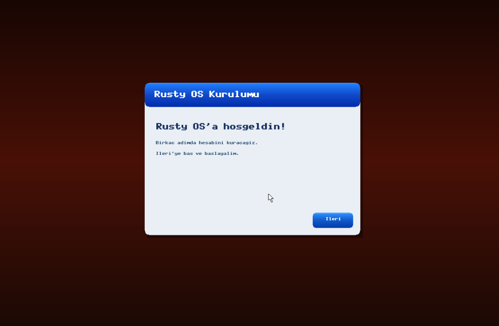
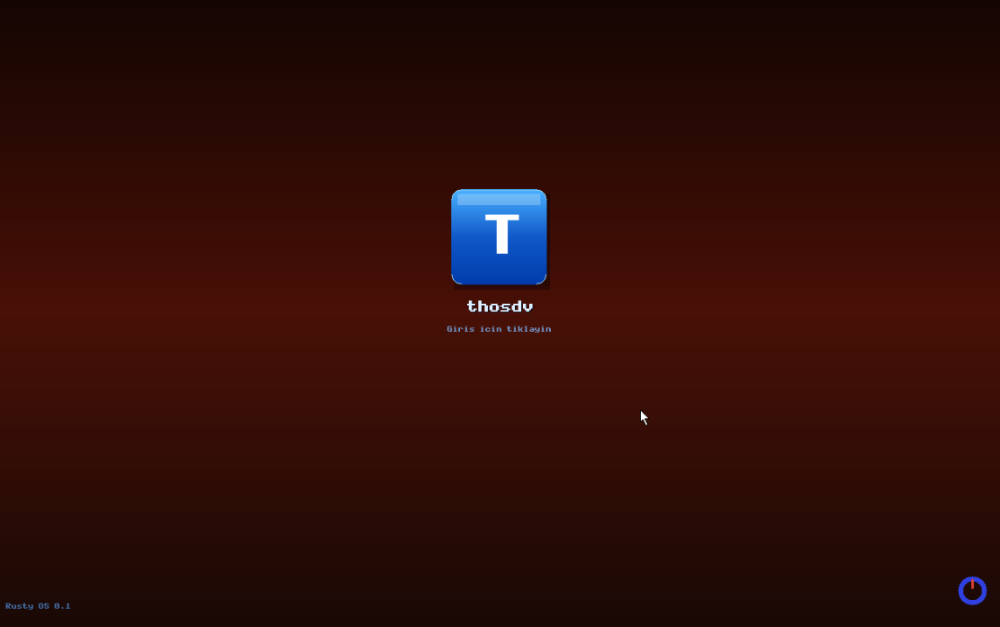
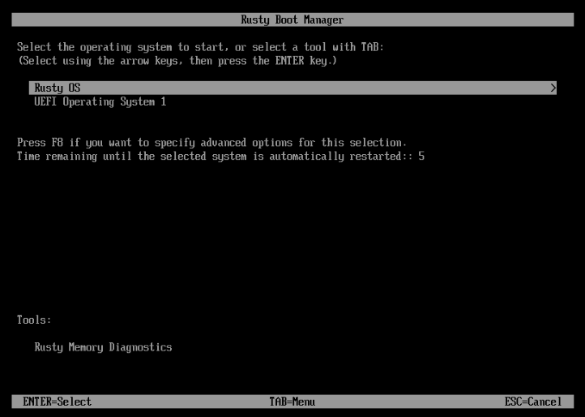
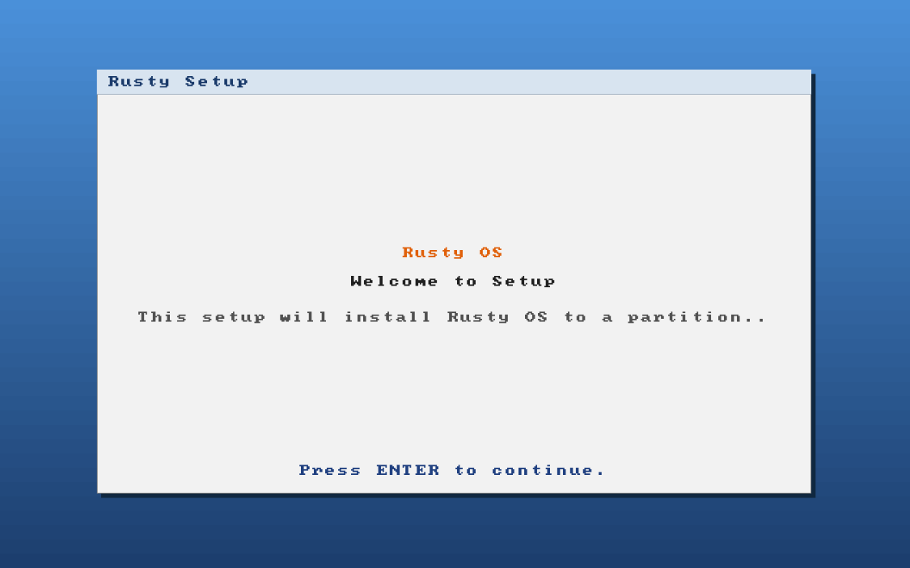

<p align="center">
  <h1 align="center">Rusty OS (T-OS 3.0)</h1>
  <p align="center">
    <b>A modern, bare-metal desktop operating system written from scratch in pure Rust for x86_64 architecture.</b>
  </p>
</p>

<p align="center">
  
  
  
  
</p>

> **Is this a Linux distribution or a Windows mod?**  
> No. Rusty OS runs its own custom `no_std` kernel written from scratch. It does not share source code or binaries with Linux, Windows, or any existing operating system kernel.

---

# Screenshots

<p align="center">
  
</p>
<p align="center">
  <i>Rusty OS Desktop: Custom Window Manager, Start Menu, Command Prompt, and Context Menu.</i>
</p>

<p align="center">
  
  
</p>
<p align="center">
  <i>Left: First-Time Setup Wizard (OOBE). Right: User Login Screen.</i>
</p>

<details>
  <summary><b>📸 Click for Bootloader & Installer Screenshots</b></summary>
  <br>
  <p align="center">
    <br>
    <i>Custom UEFI Bootloader & Memory Diagnostics Manager</i>
  </p>
  <p align="center">
    <br>
    <i>Bare-metal RPE Partition Installer</i>
  </p>
</details>

---

# Key Features

* **Custom UEFI Bootloader:** Built-in boot manager, dual-boot chainloading, and ELF loader.
* **Full Driver Stack:** NVMe, AHCI (SATA), IDE/ATA, xHCI (USB 3.0), USB HID, Intel HDA & AC'97 Audio, PS/2, RTC.
* **Memory Management:** Physical Frame Allocator, 4-level Paging (Virtual Memory Manager), Kernel Heap Allocator.
* **Preemptive Scheduling & Syscalls:** Ring-3 process isolation with fast `SYSCALL`/`SYSRET` ABI.
* **Filesystem & VFS:** VFS abstraction layer, GPT partition parser, and full FAT32 read/write support.
* **Complete Userland GUI:** Window Manager, Taskbar, Start Menu, Registry Editor, and 10+ native apps.
* **Bare-Metal Installer (RPE):** Self-contained Preinstallation Environment capable of installing onto real GPT disks alongside Windows/Linux.

---

# How to Build and Run

### Dependencies
Ensure you have the following installed on a Linux host system:
* `rust` (latest **nightly** toolchain with `x86_64-unknown-none` target)
* `qemu-system-x86_64` (v10.1+) with **OVMF** UEFI firmware
* `mtools`
* `make`

### Building & Running Commands

```shell
# Clone the repository
$ git clone [https://github.com/thosdv63/Rusty-OS.git](https://github.com/thosdv63/Rusty-OS.git)
$ cd Rusty-OS

# Build everything and launch Rusty OS in QEMU
$ make run

# Build the RPE installer image and test installation against a virtual GPT disk
$ make run-rpe

# Boot a system that has already been installed to the virtual disk
$ make run-installed
```

---

# Documentation

Full architectural documentation is available in both English and Turkish:

* 📖 **[English Documentation](documentary/en/00-overview.md)**
* 📖 **[Türkçe Dokümantasyon](documentary/tr/00-genel-bakis.md)**

---

## Türkçe Açıklama

**Rusty OS (T-OS 3.0)**, x86_64 mimarisi için sıfırdan Rust dili ile geliştirilmiş `no_std` bir masaüstü işletim sistemidir.

Kendi UEFI önyükleyicisi üzerinden açılır; bellek yönetimi, donanım sürücüleri (NVMe, xHCI, Intel HDA), FAT32 dosya sistemi, SYSCALL/SYSRET tabanlı ring-3 süreç yönetimi ve Windows 7 ilhamlı Aero masaüstü ortamını tamamen bare-metal seviyesinde ayağa kaldırır.

Ayrıca, mevcut işletim sistemlerine zarar vermeden sistemi gerçek GPT disklere kurabilen **RPE (Rusty Preinstallation Environment)** ortamına sahiptir.

---

# License

Distributed under the **MIT License**. See [`LICENSE`](LICENSE) for details.
